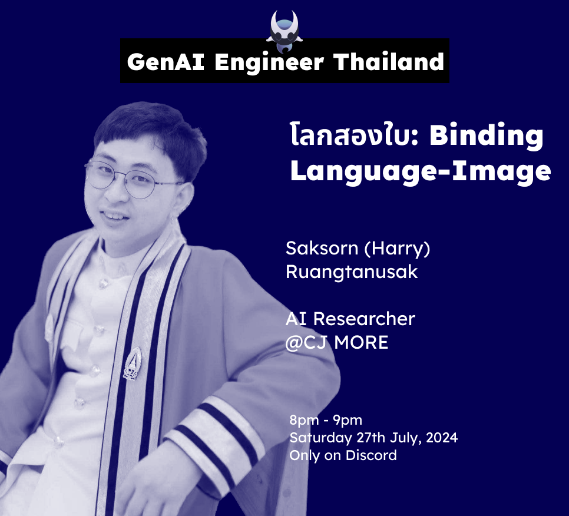

# โลกสองใบ: Binding Language-Image

by Saksorn Ruangtanusak (Harry)

[Github](https://github.com/huak95) | [Linkedin](https://www.linkedin.com/in/saksorn/) | [Kaggle](https://www.kaggle.com/saksornh)

## Resource

[Video](TBA) | [Slide](./material/slide_binding_language_Image.pdf)

## Summary
Recent breakthroughs in computer vision and natural language processing are reshaping the realms of Image Retrieval, Image Captioning, and Visual Question Answering (VQA). 

Moving beyond traditional hand-crafted features, cutting-edge deep learning models now deliver unprecedented accuracy and contextual understanding. 

These innovative approaches are not just enhancing performance but are also unlocking new possibilities for seamless and intuitive interactions between visual and textual data, heralding an exciting new era in artificial intelligence.